# AI 桌宠 开发路线图 v1.1

- 文档版本:v1.1(高层路线图;在 v1.0 上做章节级增量,不压平)
- 创建日期:2026-05-01(v1.0)/ 2026-05-02(v1.1 增量)
- 适用阶段:M0 完成 → M1 启动前(实施期入口);v1.1 反映 M1 D3 期 ADR-015 决策
- 输出形式:Mermaid 可视化 + 表格
- 关联:
  - [BASELINE.md](BASELINE.md)
  - [需求设计/2026-05-01-ai-desktop-pet-prd-v1.0.md](需求设计/2026-05-01-ai-desktop-pet-prd-v1.0.md)(已升 v1.1)
  - [架构设计/2026-05-01-system-architecture-v1.0.md](架构设计/2026-05-01-system-architecture-v1.0.md)(已升 v1.1)
  - [需求设计/2026-05-01-ai-desktop-pet-flows-v1.0.md](需求设计/2026-05-01-ai-desktop-pet-flows-v1.0.md)(已升 v1.1)
  - [M0-ADRs/](M0-ADRs/)(15 项 Accepted)

> **关于本文档**:基于 PRD v1.0 §13 与架构 v1.0 §15 的 M1-M5 实施任务对照,展开为可视化路线图。**日期为相对周次锚定**(M0 = W0,2026-05-01 起);实际启动日由项目主理决定。

## 变更摘要

### v1.1(2026-05-02)

实施期 M1 D3 经 [ADR-015](M0-ADRs/ADR-015-chat-three-modes.md)《对话面板三形态架构》Accepted 后增量:

- §3.2 模块矩阵:`ChatService + LLMProvider` 行展开为 B.3.a-f 跨 M1-M5;新增 `ConversationStore` / `控制按钮区(模块 A 延伸)` / `hub 总面板` 行
- §5.2-5.6 各 milestone:**Mermaid 图保持 v1.0**(高层视角不变);story 级增量(B.3.a-f / 智能穿透 II/III/I/IV / 入口前置 TBD)由 [progress/m1-5.md](../../progress/) 作为权威细节源
- 头部关联文档行加 v1.1 标记

未变更:§1 三引擎 / §3.1 模块 DAG Mermaid / §4 关键路径 / §6 风险 / §7 状态门 / §8-§11 工作流 与 v1.0 一致。

---

## 1. 总览

### 1.1 三引擎与五大主线

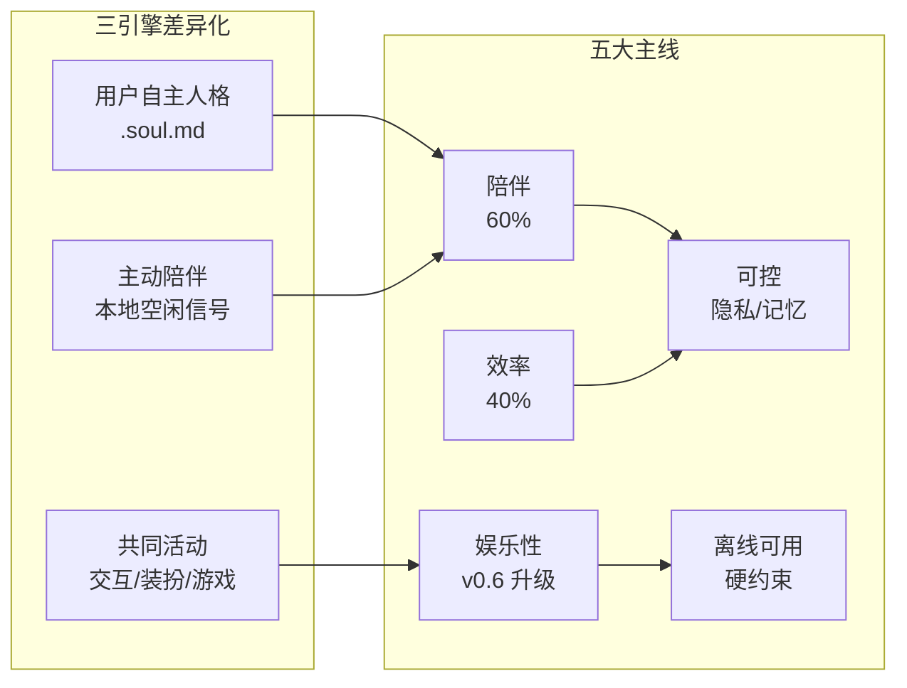

### 1.2 关键约束速查

| 约束 | 含义 |
|---|---|
| **Local-first** | 不引入用户数据强制上传 |
| **用户自主权** | 不削弱用户对 .soul.md / 装扮 / 设置的控制 |
| **非养成** | 不引入流失 / 死亡 / 必须签到 |
| **隐私边界** | 不读应用名 / 窗口标题 / 输入内容 / 麦克风 |
| **安全护栏** | 任何人格 / 游戏不能覆盖系统安全前缀 |

### 1.3 五份基线 → 路线图

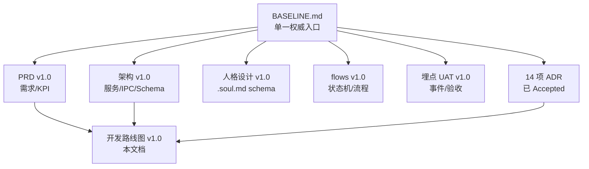

---

## 2. 项目时间轴(W0-W10)

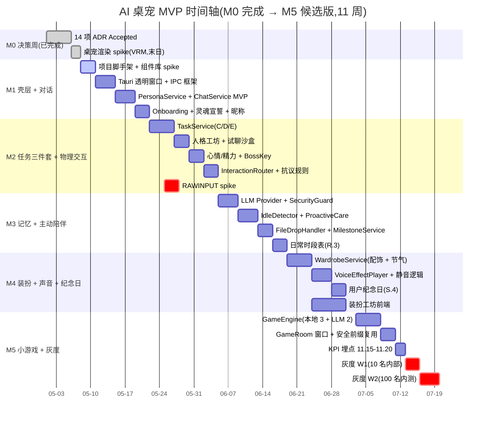

> **节点说明**:`active` = 进行中;`done` = 已完成;`crit` = 关键路径节点(任一延期 → 整体延期)。

---

## 3. 模块依赖 DAG

### 3.1 全模块依赖图

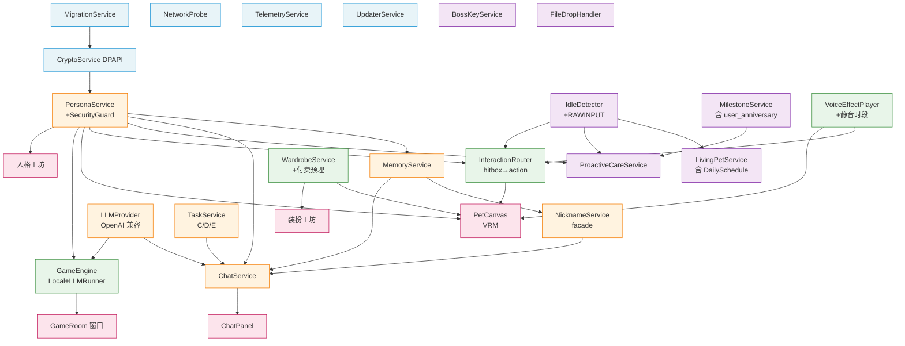

### 3.2 模块 → milestone 占用矩阵

> **v1.1 增量**:`ChatService + LLMProvider` 行已按 ADR-015 拆 B.3.a-f 跨 M1-M5;新增 `ConversationStore` / `控制按钮区(模块 A 延伸)` / `hub 总面板` 三行。

| 模块 | M1 | M2 | M3 | M4 | M5 |
|---|---|---|---|---|---|
| **基础设施**(Migration / Crypto / Telemetry / Network / Updater) | 骨架 | — | 完善 | — | 灰度埋点 |
| **PersonaService** | MVP(加载/激活) | 工坊 + 沙盒 | — | — | — |
| **MemoryService + NicknameService** | MVP | — | — | — | — |
| **ChatService + LLMProvider** | MVP(单 Provider)+ **B.3.a 形态 2 极简** | — | OpenAI 兼容完整 + SecurityGuard + **B.3.d 多 conversation** | — | — |
| **ConversationStore**(v1.1 / ADR-015) | 表 schema 就位(I.1) | — | 完整 CRUD UI(随 B.3.d) | — | — |
| **控制按钮区**(模块 A 延伸,v1.1) | — | **B.3.b 骨架**(0.5d) | — | — | — |
| **ChatPanel 形态 2 磁吸**(v1.1) | (B.3.a 极简内含) | **B.3.c 磁吸交互** | — | — | — |
| **hub 总面板**(形态 1,v1.1) | — | — | — | **B.3.e 4 tab** | — |
| **形态 3 漫画气泡**(v1.1) | — | — | — | — | **B.3.f 角色窗内** |
| **TaskService**(C/D/E) | — | 全量 | — | — | — |
| **LivingPetService** | 自由活动初版 | mood/energy + 持久化 | DailySchedule(R.3) | — | — |
| **IdleDetector** | — | (N.4 spike) | 主体 + ProactiveCare | — | — |
| **ProactiveCareService** | — | — | 主体 + 频率上限 + 安静时段 | — | — |
| **BossKeyService** | (A.5 占位 emit) | 摸鱼模式接管 | — | — | — |
| **FileDropHandler** | — | — | 文本类全功能 + **接收源扩展(角色窗/各形态输入区,ADR-015)** | — | — |
| **MilestoneService** | — | — | 首次 7/30 天 | + user_anniversary | — |
| **InteractionRouter**(模块 N) | — | hitbox + reaction_table + 抗议 | — | — | — |
| **WardrobeService**(模块 O) | — | — | — | 配饰 + 节气 + 付费预埋 | — |
| **VoiceEffectPlayer**(模块 P) | — | — | — | 音效 + 静音时段 | — |
| **GameEngine**(模块 Q) | — | — | — | — | 全量(Local 3 + LLM 2)+ **hub 游戏 tab launcher** |

---

## 4. 关键路径(blocker chain)

任一节点延期 → 整体延期。

```mermaid
graph LR
    A[M0:VRM 渲染 spike<br/>ADR-002 Superseded] --> B[M1:Tauri + Vue 骨架<br/>组件库 spike]
    B --> C[M1:PersonaService MVP<br/>+ ChatService MVP]
    C --> D[M1:Onboarding + Soul Pledge<br/>ADR-008]

    D --> E[M2:TaskService + 人格工坊]
    E --> F[M2:InteractionRouter<br/>+ 抗议规则]
    F --> G[M2:RAWINPUT spike<br/>决断 N.4]

    G --> H[M3:LLM Provider 完整<br/>+ SecurityGuard ADR-006]
    H --> I[M3:IdleDetector<br/>+ ProactiveCare]
    I --> J[M3:FileDrop + Milestone<br/>+ R.3 日常时段]

    J --> K[M4:WardrobeService<br/>blocker:配饰美术 ADR-003]
    K --> L[M4:VoiceEffectPlayer<br/>blocker:音效自录 ADR-010]
    L --> M[M4:用户纪念日 S.4]

    M --> N[M5:GameEngine<br/>blocker:场景 yaml ADR-007]
    N --> O[M5:KPI 埋点 11.15-11.20]
    O --> P[M5:灰度 W1 内部 10 人]
    P --> Q[M5:灰度 W2 内测 100 人]
    Q --> R[发布候选版<br/>RC]

    classDef critical fill:#ffebee,stroke:#c62828,stroke-width:2px
    classDef done fill:#e8f5e9,stroke:#2e7d32
    class A done
    class G,K,L,N,P,Q critical
```

### 4.1 关键 spike 与决策点

| 节点 | 时机 | 决策内容 | 失败降级 |
|---|---|---|---|
| **桌宠渲染 spike(VRM)** | M0 末(已完成,从 Live2D 切换) | 启动 < 1500ms / 内存 < 150MB / 配饰挂载点(humanoid bone)可行 | 降级"整套皮肤"(配饰仅整体替换,牺牲 KPI 11.17) |
| **组件库 spike** | M1 W1 第 1 天 | Naive UI vs Element Plus 哪个更适合 | 默认 Naive UI |
| **RAWINPUT spike** | M2 内 | 实现成本是否可控 | 降级"快速 idle 切换"近似信号(N.4 体验弱化) |
| **配饰美术管线就绪** | M4 启动前 | 8 件配饰 + 4 套节气资源齐 | 推迟节气皮肤到 M4 末或 P1-R1 |
| **音效自录交付** | M4 启动前 | 12-20 条 OGG 录制完成 | 推迟到 M4 末或 P1-R1 |
| **LLM 场景 yaml 法务** | M5 启动前 | 故事接龙 + 咖啡店老板法务签字 | 推迟 LLM 游戏到 P1-R2 |
| **灰度 W1 退出** | M5 W2 入口 | 内部 10 人无 P0 事故 | 修复后再扩 100 人 |
| **灰度 W2 退出** | M5 末 | KPI 11.15-11.20 至少 3 项达标 + 杀死指标无命中 | 修复 + 延期或降级 |

---

## 5. 各 Milestone 详细

### 5.1 M0 决策周(已完成,2026-05-01)

**入口**:产品立项;PRD v0.6/v0.7 草稿;14 项 ADR 草案。
**出口**:✅ 14 项 ADR 全部 Accepted;✅ 五份对齐文档压平到 v1.0;✅ 桌宠渲染 spike 通过(原 Live2D 改为 VRM)。

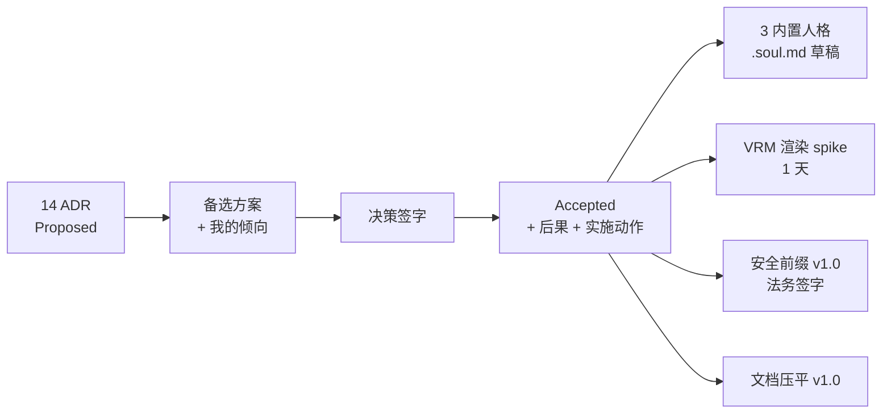

### 5.2 M1 壳层 + 对话(W1-W2,2 周)

**入口**:M0 出口达成。
**出口**:核心 UI 跑通;快捷键稳定(`Ctrl+Alt+Space` / `Ctrl+Shift+B`);崩溃率 < 3%;Onboarding 6 步可走通到主态。

> **v1.1 注**:M1 实际拆 stories 见 [progress/m1.md](../../progress/m1.md):A.1-A.5 已完成 / A.6 智能穿透收口 polish(II+III)/ I.1 / I.2 / H.1 / F.1 / F.2 / B.1 / B.2 / **B.3.a 形态 2 极简版**(单 conversation + 流式,见 ADR-015)。下方 Mermaid 保留 v1.0 高层视角。

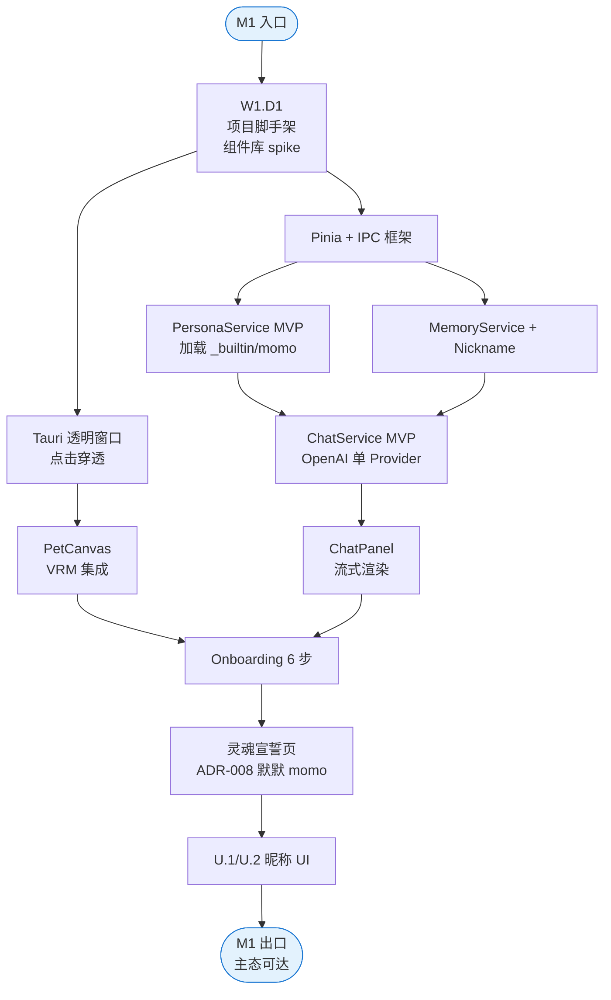

**主交付物**:
- Tauri + Vue 3 + TS + Pinia + Vite 项目脚手架
- 桌宠透明窗口(置顶 / 无边框 / 点击穿透)
- VRM 默默 momo 渲染(内置 3 个人格,但 M1 只用 momo)
- 对话面板 + 流式渲染 + OpenAI Provider
- Onboarding 6 步(灵魂宣誓 + Provider 引导 [可跳过])
- U.1 桌宠昵称 + U.2 用户昵称 UI

**风险**:
- 组件库 spike 可能拖延 2 天 → 缓解:M1 D1 必须做完
- VRM 集成异常 → M0 spike 已验证(原 Live2D 切换到 VRM),降级路线已留
- Onboarding 法务文案最终版滞后 → 用 ADR-008 v1.0 定版

### 5.3 M2 任务三件套 + 物理交互(W3-W4,2 周)

**入口**:M1 出口达成;VRM humanoid bone 配饰挂载点已验证。
**出口**:三大模块(C/D/E)离线可用;N hitbox 反应触发率 ≥ 95%;摸鱼快捷键稳定;人格切换不丢记忆。

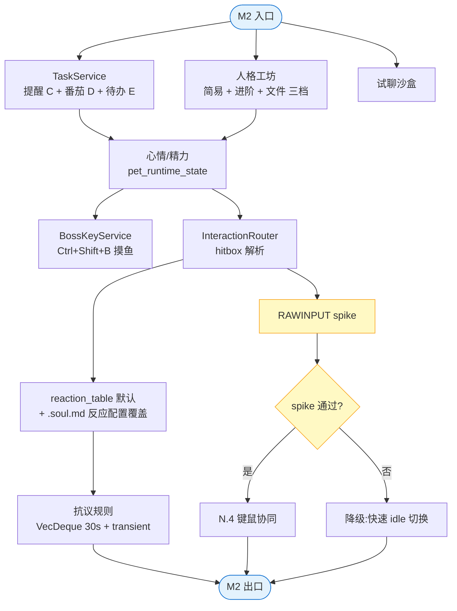

**主交付物**:
- C 提醒系统(软/硬优先级,稍后上限 3 次)
- D 番茄钟(暂停/恢复/休眠校准)
- E 待办(创建/完成/AI 拆解占位 — M3 接 LLM)
- 人格工坊 GUI 三档编辑 + 试聊沙盒
- 心情/精力运行时状态 + 持久化
- 摸鱼模式(隐藏/恢复 < 200ms,缓冲提醒)
- N 物理交互(hitbox 反应、抗议非持久化)
- N.4 键鼠协同(若 RAWINPUT 通过)

### 5.4 M3 记忆 + 主动陪伴(W5-W6,2 周)

**入口**:M2 出口达成;LLM Provider 决定上线 OpenAI 兼容协议。
**出口**:安全前缀模板覆盖;模块 J 频率上限可验证;模块 L 文本类全功能;桌宠日常时段动作分布合理。

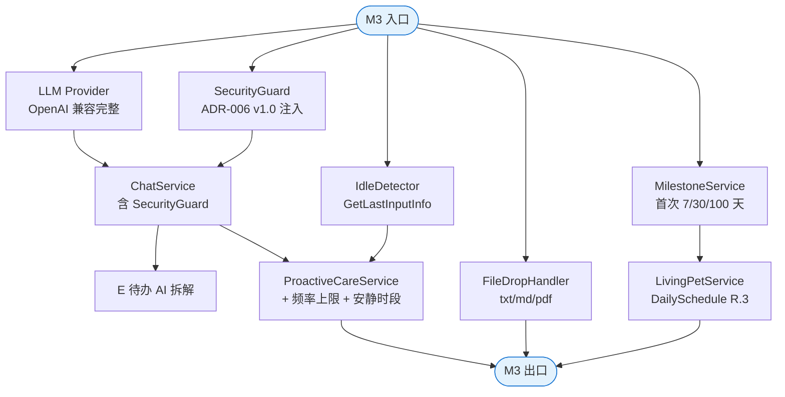

**主交付物**:
- LLM Provider 完整(OpenAI 协议 + 6 个 preset)
- SecurityGuard 注入(安全前缀 v1.0 + 地区补充)
- E 待办 AI 拆解(接 LLM)
- IdleDetector(GetLastInputInfo)
- ProactiveCareService(频率 4 次/日 + 2h 间隔 + 安静时段)
- L 文件拖入(.txt/.md/.pdf)
- MilestoneService(首次 7/30/100 天等)
- LivingPetService DailySchedule(R.3 桌宠日常时段)
- 自动更新 UpdaterService

### 5.5 M4 装扮 + 声音 + 纪念日(W7-W8,2 周)

**入口**:M3 出口达成;配饰美术(8 件 + 4 套节气)交付;音效包(12-20 条 OGG)录制完成。
**出口**:装扮切换 < 500ms;声音工作日 09:00-18:00 严格 0 触发;用户纪念日时区跨日正确。

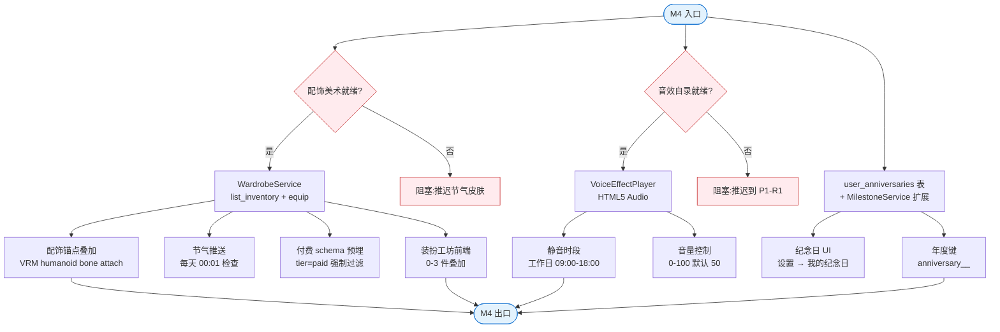

**主交付物**:
- O.1 配饰系统(8 件)+ O.2 节气皮肤(4 套)
- O.3 付费 schema 预埋(`tier='paid'` 强制过滤)
- 装扮工坊前端
- P 声音表情(默认音效包 + 静音时段 + 音量)
- S.4 用户纪念日(添加 / 触达 / 年度去重)

### 5.6 M5 小游戏 + 灰度(W9-W10,2 周)

**入口**:M4 出口达成;`game_scenes/{story_relay,cafe_owner}.yaml` 法务签字。
**出口**:KPI 11.15-11.20 全部可观测;灰度 W2(100 人)无 P0 事故;杀死指标无命中。

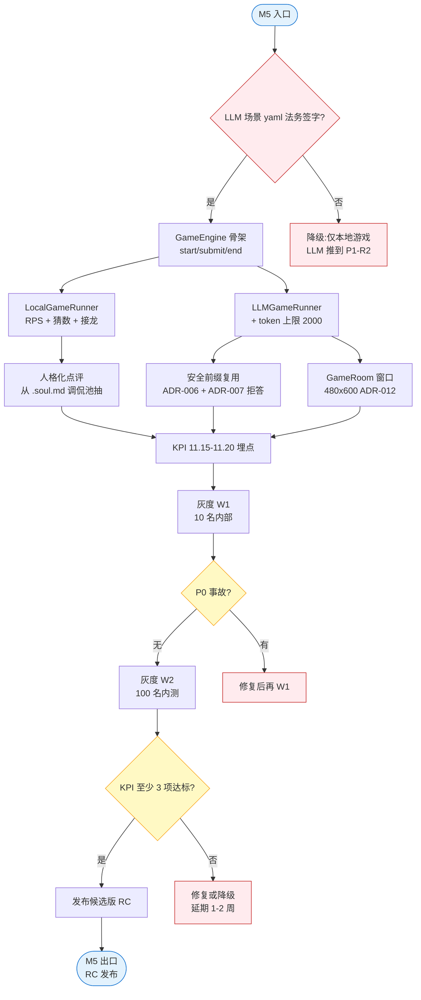

**主交付物**:
- Q.1-Q.2 本地游戏(RPS / 猜数字 / 词语接龙)
- Q.3-Q.4 LLM 游戏(故事接龙 / 咖啡店老板)
- GameRoom 独立窗口(480 × 600)
- KPI 11.15-11.20 全套埋点
- 性能调优(常驻 < 250MB / 安装包 < 80MB)
- 灰度 W1 + W2 反馈采集
- 发布候选版(RC)

---

## 6. 风险时间线

13 项风险及其显化时机与缓解。命中即触发缓解动作,不命中维持原计划。

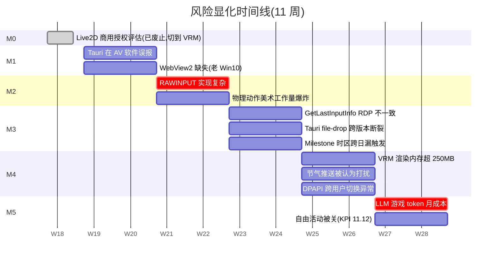

### 6.1 风险登记表

| # | 风险 | 显化时机 | 影响 | 缓解 |
|---|---|---|---|---|
| 1 | ~~Live2D 商用授权~~(已废止,切 VRM) | M0 末 spike | M0 选型 blocked | 已切 VRM(MIT 开源,无授权风险),原 Live2D 路线作废,详见 ADR-002 顶部 Superseded 说明 |
| 2 | Tauri AV 软件误报 | M1 测试 | 用户启动失败 | SmartScreen 信誉申请、AV 厂商白名单 |
| 3 | WebView2 缺失 | M1 安装期 | 应用打不开 | 安装包内置 Bootstrapper |
| 4 | RAWINPUT 实现复杂 | M2 spike | N.4 键鼠协同延期 | 降级"快速 idle 切换"近似信号(不影响其他 N 子项) |
| 5 | 物理动作美术工作量大 | M2 实施 | 美术延期 | 12 个核心动作上限(ADR-004),复用 stretch/yawn |
| 6 | GetLastInputInfo RDP 不一致 | M3 测试 | 主动关心误触发 | RDP 场景默认关闭模块 J |
| 7 | Tauri file-drop 跨版本断裂 | M3 集成测试 | 文件拖入功能断裂 | M0 锁定 Tauri 2.x 版本,M3 集成测试覆盖 |
| 8 | Milestone 时区跨日 | M3 + M5 | 重复/漏触发 | 本地时区 + 启动期幂等检查 + `milestones.id` PK 唯一 |
| 9 | VRM 渲染内存超 250MB | M4-M5 性能调优 | 性能预算超 | LOD 切换 / 低多边形 / 低分辨率贴图模式兜底 |
| 10 | 节气推送被认为打扰 | M5 灰度 | 装扮使用率(KPI 11.17)不达标 | 默认每节气仅推 1 次;用户拒绝当年不再推 |
| 11 | DPAPI 跨用户切换异常 | M3 + M5 测试 | 多用户机器混用 | 作为 feature 暴露(账户绑定) |
| 12 | LLM 游戏 token 月成本 | M5 上线后 | 用户账单爆炸 | 单次 2000 token 上限 + 设置可见消耗统计 + 告警 |
| 13 | 自由活动被关(KPI 11.12) | M5 灰度后 | 生命感关闭率 > 15% | 灰度数据驱动;> 15% 默认关闭"逛桌面"子项 |

---

## 7. 状态门(每个 milestone 出口决策)

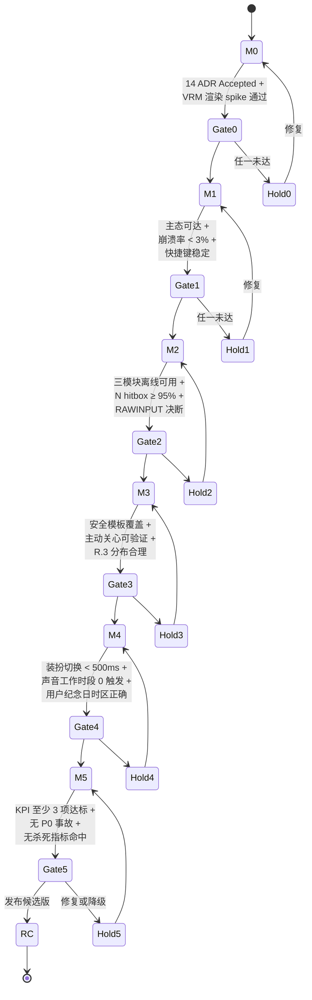

### 7.1 出口判断 SOP

| Milestone | 必达项 | 可妥协项(标注后通过) |
|---|---|---|
| M0 → M1 | ADR 全部 Accepted | VRM 渲染 spike 数据(可用 M1 W1 补) |
| M1 → M2 | 核心 UI 跑通 + Onboarding 完整 | API Key 引导 UX(M2 调) |
| M2 → M3 | C/D/E 离线 + 摸鱼稳定 + 物理交互 hitbox | 人格工坊 UI 美化(M3 调) |
| M3 → M4 | 主动关心频率上限 + 文件拖入文本类 + 安全前缀 | 自动更新签名(M5 决) |
| M4 → M5 | 装扮 + 声音 + 用户纪念日全量 | 装扮工坊 UX 细节(M5 调) |
| M5 → RC | KPI ≥ 3 项达标 + 杀死指标无命中 | 边界 UAT 场景(RC 后修补) |

---

## 8. 工作流约定(简短版)

### 8.1 分支策略

```
main                  ← 受保护,只接 PR
├── milestone/m1      ← M1 开发分支
│   ├── feat/m1-shell
│   ├── feat/m1-chat
│   └── feat/m1-onboarding
├── milestone/m2
└── ...
```

每个 milestone 用一个长生命周期分支,模块从该分支拉 feature 分支,完成后合回 milestone 分支。milestone 出口达成后合 main 并打 tag(`v0.M1.0` / `v0.M2.0` / ...)。

### 8.2 提交与 PR

- Commit 格式:`<type>(<scope>): <subject>` — 例 `feat(persona): add .soul.md import`
- type 枚举:`feat / fix / refactor / docs / test / perf / chore`
- PR 必须关联 ADR 编号(若决策类)或 PRD 模块号(若实施类)
- 至少 1 名 reviewer + CI 通过才能合并

### 8.3 CI 流程

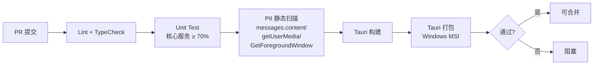

### 8.4 灰度发布(M5)

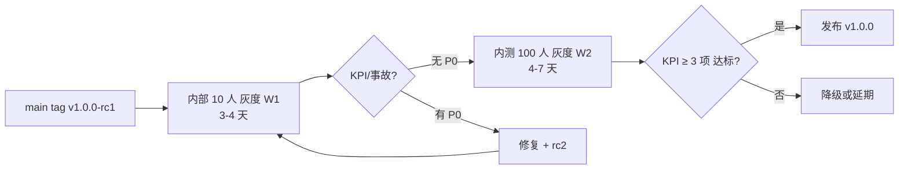

---

## 9. 跟踪机制

### 9.1 任务粒度建议

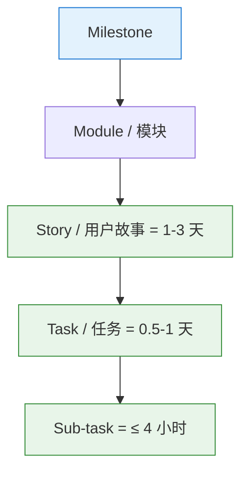

- **看板列**:`Backlog / Up Next / In Progress / In Review / Done`
- 每周 demo + 站会(若多人项目)
- 每个 milestone 末做回顾(Retro):做对什么 / 做错什么 / 下次怎么改

### 9.2 关键监控

实施期持续观察:

| 指标 | 阈值 | 监控位置 |
|---|---|---|
| 当前 milestone 完成度 | 按周 ≥ 50% / 75% / 100% | 看板 |
| 关键路径节点延期 | 0 | 甘特图 + 站会 |
| Spike 决策延期 | 0 | 风险登记 |
| 崩溃率(Dev 测试机) | < 3% | 本地 error_logs |
| 单测覆盖率(核心服务) | ≥ 70% | CI |
| PII 静态扫描 | 0 命中 | CI |

### 9.3 文档同步

- 实施期发现 PRD/架构 与现实偏差 → 在 PR 中同步更新对应 v1.0 文档
- 重大决策变化 → 走 ADR-015+ 流程,标 Superseded 引用旧 ADR
- 实施期不再叠加增量补丁,变化直接合到 v1.0 主干(或升 v1.1)

---

## 10. 给项目主理的 5 条速读

1. **关键路径不容延期**:M0 VRM 渲染 spike → M2 RAWINPUT spike → M4 美术 + 音效就绪 → M5 法务签字 → 灰度。任一节点延期 → 整体延期。
2. **风险已知 13 项**,前置缓解都在 ADR 里。监控时机分散在 M0/M2/M3/M4/M5,每周看一次风险表。
3. **每个 milestone 2 周**,共 10 周。M0 已完成,M1 立即可启动。
4. **灰度 2 周不可砍**:W1 内部 10 人 → W2 内测 100 人。不要直接开放外部下载。
5. **杀死指标比 KPI 更重要**:命中即触发熔断(降级或回退),不应为 KPI 硬数字熬夜赶。

---

## 11. 下一步

如果路线图通过审视,M1 启动:

```
M1 第 1 天:
  上午:Tauri 2.x + Vue 3 + TS + Pinia + Vite 项目脚手架
        组件库 spike(Naive UI vs Element Plus)
  下午:决定组件库;开始 PetCanvas 基础架子
        IPC 框架草搭 + 第一个 ping/pong

M1 第 1 周末:
  桌宠透明窗口 + VRM momo 渲染 + 基础点击
  ChatService MVP(单 Provider)+ 流式渲染
  MemoryService + NicknameService 骨架

M1 第 2 周末:
  Onboarding 6 步可走通(灵魂宣誓页用 ADR-008 文案)
  U.1 / U.2 昵称 UI
  系统托盘 + 快捷键(Ctrl+Alt+Space)
  M1 → M2 出口检查
```
